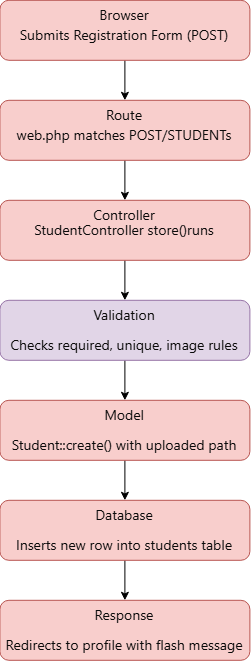
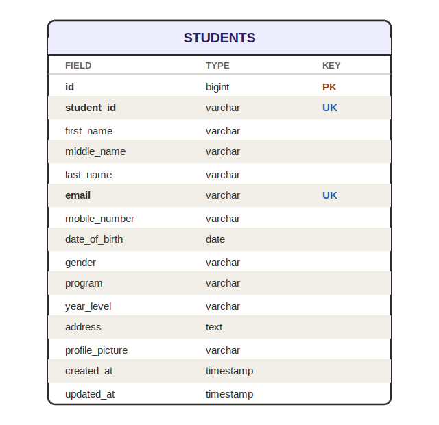
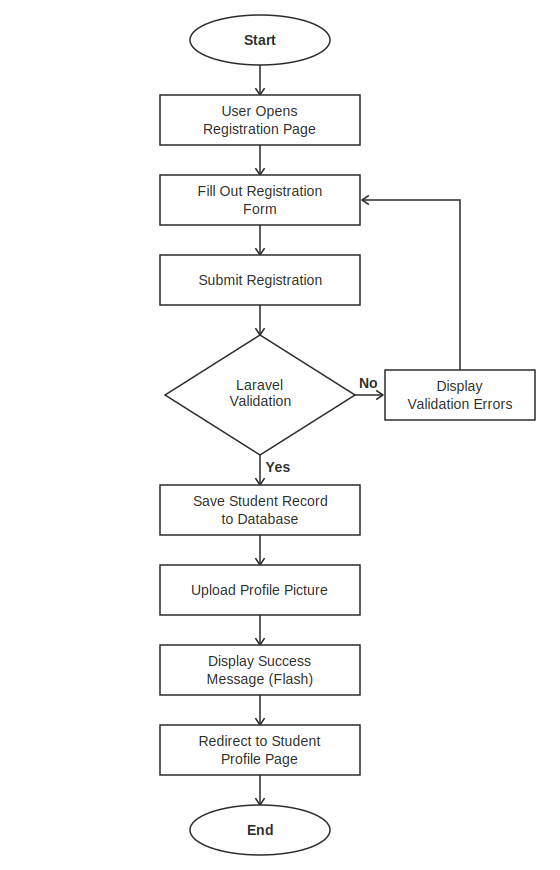
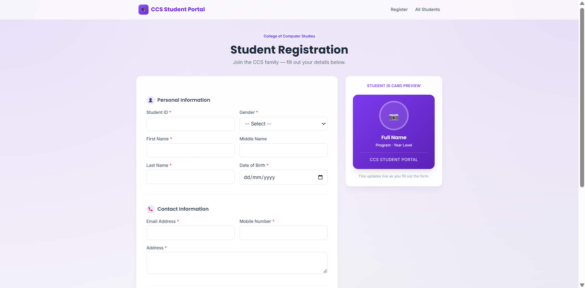
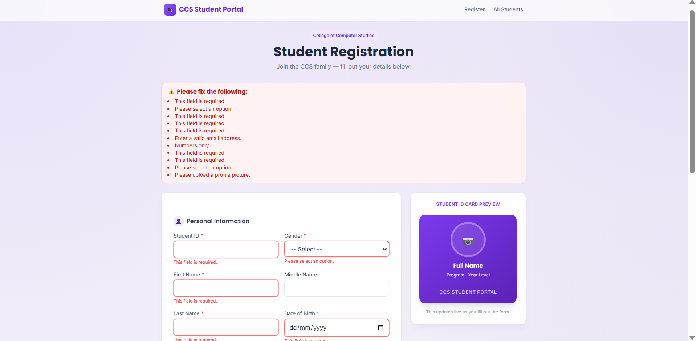
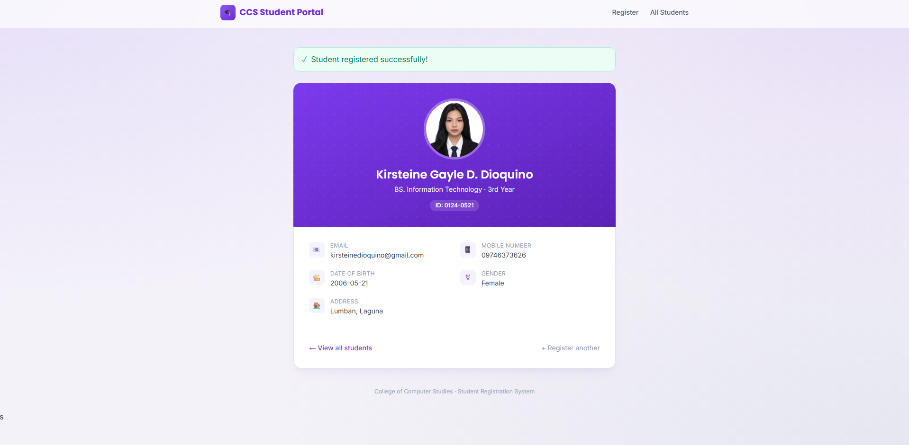
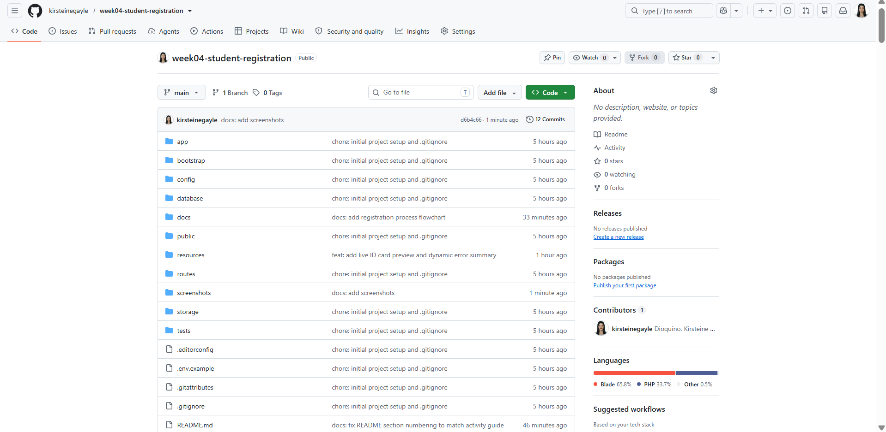

# CCS Student Portal — Student Registration System

## 1. Project Overview

The College of Computer Studies (CCS) is transitioning from paper-based student registration to a digital registration system. This project, the **CCS Student Portal**, is a Student Registration System built using Laravel that allows students to register online while ensuring that submitted information is valid, secure, and stored correctly.

A student registration system is a common feature in enterprise information systems — universities, companies, hospitals, banks, and government agencies all require secure and validated registration systems to collect and manage user information. Data validation is critical in these systems because it prevents incomplete, incorrect, or malicious data from entering the database, protecting both the institution and the students whose information is being collected.

Registration systems like this one play a foundational role in enterprise applications by handling the full lifecycle of a client request — from form submission, through validation and file handling, to secure database storage — skills that are directly transferable to larger systems such as e-commerce platforms, hospital management systems, and banking portals.

---

## 2. Objectives

At the end of this activity, the following learning objectives were accomplished:

1. Developed HTML forms using Blade templates.
2. Processed client requests using Laravel controllers.
3. Implemented server-side validation using Laravel Validation Rules.
4. Displayed flash messages for successful and failed operations.
5. Uploaded and securely stored files using Laravel Storage.
6. Designed and implemented a relational database table.
7. Documented the software development process using Markdown.
8. Applied Git version control and portfolio-building practices.

---

## 3. Laravel Request Lifecycle

When a student submits the registration form, the request goes through the following stages in Laravel:

1. **Browser** — The student fills out the registration form and clicks "Register Student." The browser sends a `POST` request to `/students`, including the form data and the uploaded profile picture.
2. **Route** — Laravel's router (`routes/web.php`) matches the incoming request to the `students.store` route, which points to the `store()` method in `StudentController`.
3. **Controller** — The `StudentController@store` method receives the request. This is where the request is processed before anything touches the database.
4. **Validation** — Inside the controller, `$request->validate()` checks every field against the defined rules (required, unique, email, numeric, image, etc.). If validation fails, Laravel automatically redirects back to the form with error messages and the old input. If it passes, execution continues.
5. **Model** — Once validation passes, the profile picture is stored using Laravel Storage, and the validated data (including the picture's file path) is passed to the `Student` model via `Student::create()`.
6. **Database** — The Eloquent ORM translates `Student::create()` into an `INSERT` SQL statement, saving the new student record into the `students` table in MySQL.
7. **Response** — After the record is saved, the controller redirects the student to their profile page (`students.show`) with a flash success message, displayed using Laravel's session flash data.

### Laravel Request Lifecycle Diagram

---

## 4. Validation Rules

The registration form enforces the following server-side validation rules using Laravel's `$request->validate()`:

| Field | Rule | Why It Matters |
|---|---|---|
| `student_id` | `required\|unique:students` | Ensures every student has an ID and prevents duplicate registrations under the same ID. |
| `first_name`, `last_name` | `required\|string\|max:100` | Ensures core identity fields are always provided and prevents excessively long input. |
| `middle_name` | `nullable\|string\|max:100` | Optional field — not every student has a middle name. |
| `email` | `required\|email\|unique:students` | Confirms the email is valid and prevents duplicate registrations under the same address. |
| `mobile_number` | `required\|numeric` | Prevents letters or symbols from being entered into a phone number field. |
| `date_of_birth` | `required\|date` | Ensures the value is a valid, parseable date. |
| `gender`, `program`, `year_level` | `required` | Essential classification fields used for student records and reporting. |
| `address` | `required\|string` | Ensures contact/location information is always captured. |
| `profile_picture` | `required\|image\|mimes:jpg,jpeg,png\|max:2048` | Restricts uploads to actual image files under 2MB, preventing malicious or oversized uploads. |

### Client-Side vs. Server-Side Validation
This project includes JavaScript client-side validation that gives students instant feedback (red field outlines and inline error messages) before the form is submitted. However, server-side validation remains the primary line of defense, since client-side checks can be bypassed. Both layers work together to create a smooth experience while keeping the data secure.

---

## 5. Database Design

### Entity Relationship Diagram (ERD)

### Table Structure: `students`

| Column | Data Type | Constraints |
|---|---|---|
| `id` | BIGINT (unsigned) | Primary Key, Auto-increment |
| `student_id` | VARCHAR(255) | Unique, Not Null |
| `first_name` | VARCHAR(255) | Not Null |
| `middle_name` | VARCHAR(255) | Nullable |
| `last_name` | VARCHAR(255) | Not Null |
| `email` | VARCHAR(255) | Unique, Not Null |
| `mobile_number` | VARCHAR(255) | Not Null |
| `date_of_birth` | DATE | Not Null |
| `gender` | VARCHAR(255) | Not Null |
| `program` | VARCHAR(255) | Not Null |
| `year_level` | VARCHAR(255) | Not Null |
| `address` | TEXT | Not Null |
| `profile_picture` | VARCHAR(255) | Not Null (stores file path, not the image itself) |
| `created_at` | TIMESTAMP | Auto-generated by Laravel |
| `updated_at` | TIMESTAMP | Auto-generated by Laravel |

### Design Notes
- The **primary key** (`id`) auto-increments and is generated automatically by Eloquent.
- **`student_id`** and **`email`** have unique constraints at the database level, protecting against duplicate records even if application-level validation were bypassed.
- **`profile_picture`** stores only the relative file path (e.g., `profile_pictures/xyz.jpg`), not the binary image data. The actual file lives in `storage/app/public/profile_pictures`, made publicly accessible through a symbolic link created with `php artisan storage:link`.
- **`address`** uses `TEXT` instead of `VARCHAR` to comfortably fit longer addresses.

---

## 6. Registration Flowchart

This flow mirrors the actual implementation: form submission triggers Laravel's `store()` method, which runs validation before anything is written to the database. If validation fails, the student is redirected back with error messages (and previously entered data preserved via `old()`). If validation passes, the record is saved, the profile picture is uploaded, and the student is redirected to their profile page with a flash success message.

---

## 7. Screenshots

### 7.1 Registration Form

### 7.2 Validation Errors

### 7.3 Successful Registration & Flash Message

### 7.4 Uploaded Profile Picture

### 7.5 Database Table

### 7.6 Student Profile Page

### 7.7 VS Code Project Structure

### 7.8 GitHub Repository

---

## 8. Problems Encountered

1. **MySQL server not running / wrong port** — When first trying to connect Laravel to the database, MySQL was not running, and the XAMPP MySQL instance turned out to be running on port 3307 instead of the default 3306.
2. **Duplicate class declaration in StudentController.php** — A `ParseError` occurred because the controller file ended up with duplicated content (two `<?php` opening tags and two `class StudentController` declarations).
3. **MassAssignmentException** — When saving validated data to the database, Laravel blocked the operation because the `Student` model did not yet define a `$fillable` property.

## 9. Solutions

1. **Fixing the MySQL connection** — Started the MySQL80 Windows service (and alternatively the MySQL module in XAMPP Control Panel), confirmed the actual port it was running on (3307), and updated `DB_PORT` in the `.env` file to match.
2. **Fixing the duplicate controller content** — Selected all content in `StudentController.php`, deleted it completely, and re-pasted a single clean copy of the controller code.
3. **Fixing the MassAssignmentException** — Added a `$fillable` array to the `Student` model listing all fields collected by the registration form, allowing `Student::create()` to mass-assign them safely.

---

## 10. Reflection

Completing this Student Registration System activity gave me a deeper appreciation for how important validation is in web development. Before this project, I understood validation as just "checking if a field is empty," but working through this activity showed me it goes far beyond that. While building the system, I actually ran into a MassAssignmentException because I forgot to define the $fillable property in my Student model — Laravel refused to save the data until I explicitly told it which fields were safe to mass-assign. That experience made it clear that validation and data protection aren't just formalities; they are built-in safeguards that prevent incomplete, incorrect, or unauthorized data from ever reaching the database.

This project also taught me a lot about how user input should be handled. I learned that user input can never be fully trusted, no matter how well-designed the form looks. For example, the Student ID and email fields needed unique constraints to prevent two students from registering with the same identity, and the mobile number field needed numeric validation to stop letters or symbols from being entered. Seeing these rules actually reject bad input in real time — rather than just reading about them — helped me understand why enterprise systems like school registration platforms, banking systems, and hospital databases rely so heavily on strict validation rules to keep their records accurate and trustworthy.

One of the most valuable lessons from this activity was understanding the difference between client-side and server-side validation. I implemented JavaScript validation on the registration form so students would get instant feedback — red borders and error messages — the moment they left a blank required field. This made the form feel more responsive and user-friendly. However, I also learned that client-side validation alone is not enough, because it can easily be bypassed by disabling JavaScript in the browser. Laravel's server-side validation, running through $request->validate(), is what actually protects the database, since the server never simply trusts what the browser sends. Having both layers working together gave me a clearer picture of how real-world applications balance user experience with security.

File security was another important concept I learned through the profile picture upload feature. Allowing users to upload files is inherently risky if left unrestricted — a malicious user could attempt to upload an executable file disguised as an image, or a very large file that strains server storage. By using Laravel's image, mimes:jpg,jpeg,png, and max:2048 validation rules, I was able to restrict uploads to actual image files under 2MB, significantly reducing the risk of harmful or oversized files being stored on the server. This showed me that file handling requires just as much care as text-based validation, if not more.

Beyond the technical lessons, this activity helped me see how registration systems are used in real-world enterprise software. Schools use them to manage student records, hospitals use them to register patients, and banks use them to onboard new account holders — all relying on the same core principles of validation, secure storage, and reliable data handling that I practiced in this project. Along the way, I also ran into real setup challenges, such as my MySQL server running on a non-default port and having to fix a duplicated block of code in my controller file, both of which taught me to read error messages carefully and trace problems back to their root cause instead of guessing. Overall, this activity strengthened my understanding of how Laravel processes requests from start to finish, and gave me hands-on experience with the kind of secure, validated data handling that real-world applications depend on every day.

---

## 11. References

Laravel. (n.d.). *Laravel documentation*. https://laravel.com/docs

MDN Web Docs. (n.d.). *MDN Web Docs*. https://developer.mozilla.org/

MySQL. (n.d.). *MySQL documentation*. https://dev.mysql.com/doc/

PHP Documentation Group. (n.d.). *PHP documentation*. https://www.php.net/docs.php

Tailwind CSS. (n.d.). *Tailwind CSS documentation*. https://tailwindcss.com/docs